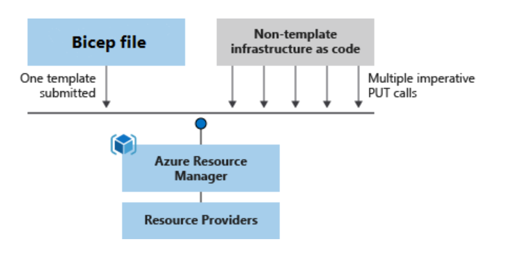

## What is Bicep

Bicep is a new template language which is used to create the ARM template. You can either write ARM JSON from scratch or use Bicep language to create the ARM template. Bicep is a domain-specific language(DSL) that uses declarative syntax to deploy Azure resources.

You can read more about [Bicep here](https://docs.microsoft.com/en-us/azure/azure-resource-manager/bicep/overview?tabs=bicep).

>If you have provisioned JSON templates before, You'll know it is non-trivial to write them so Bicep is a step to make it easier.  

All details about Bicep is available at [Bicep Github](https://github.com/Azure/bicep)

# Bicep Workshop

This workshop will help you to understand & implement the templates in [Bicep](https://docs.microsoft.com/en-us/azure/azure-resource-manager/bicep/overview?tabs=bicep). You will go through multiple challenges and after completing the challenges you should have a working knowledge of Bicep.

## Environment Setup

You need to setup your machine before you should run the challenges.

- Visual studio code
  - You can download the VS code from [here](https://code.visualstudio.com/download)
- Visual Studio code Bicep extension
  - Install the VS code extension from [here](https://marketplace.visualstudio.com/items?itemName=ms-azuretools.vscode-bicep)
- CLI setup
  - Please refer this [link](https://docs.microsoft.com/en-us/azure/azure-resource-manager/bicep/install) to install & run Bicep. You can use either Azure CLI or Powershell.

Once you have setup your environment, You can start the bicep workshop [challenges](./Challenge1.md).

## Engineering Docs

- Team Working [Agreement](.github/WorkingAgreement.md)
- Team [Engineering Practices](.github/EngineeringPractices.md)
- CSE Engineering Fundamentals [Playbook](https://github.com/Microsoft/code-with-engineering-playbook)

## How to file issues and get help

This project uses GitHub Issues to track bugs and feature requests. Please search the existing issues before filing new issues to avoid duplicates. For new issues, file your bug or feature request as a new issue.

For help and questions about using this project, please open a GitHub issue.

## Contributing

This project welcomes contributions and suggestions.  Most contributions require you to agree to a Contributor License Agreement (CLA) declaring that you have the right to, and actually do, grant us the rights to use your contribution. For details, visit <https://cla.opensource.microsoft.com>

When you submit a pull request, a CLA bot will automatically determine whether you need to provide a CLA and decorate the PR appropriately (e.g., status check, comment). Simply follow the instructions provided by the bot. You will only need to do this once across all repos using our CLA.

This project has adopted the [Microsoft Open Source Code of Conduct](https://opensource.microsoft.com/codeofconduct/). For more information see the [Code of Conduct FAQ](https://opensource.microsoft.com/codeofconduct/faq/) or contact [opencode@microsoft.com](mailto:opencode@microsoft.com) with any additional questions or comments.

## Trademarks

This project may contain trademarks or logos for projects, products, or services.

Authorized use of Microsoft trademarks or logos is subject to and must follow [Microsoft's Trademark & Brand Guidelines](https://www.microsoft.com/en-us/legal/intellectualproperty/trademarks/usage/general).

Use of Microsoft trademarks or logos in modified versions of this project must not cause confusion or imply Microsoft sponsorship.

Any use of third-party trademarks or logos are subject to those third-party's policies.